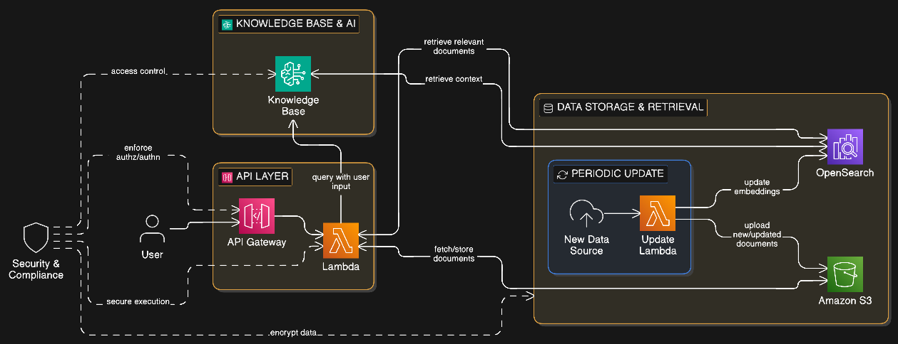

# 🚀 RAG AI Chatbot (Amazon Bedrock + OpenSearch)

A production-ready Retrieval-Augmented Generation (RAG) chatbot built
using:

-   Amazon Bedrock (LLM + Knowledge Base)
-   OpenSearch (Vector Store)
-   S3 (Document Storage)
-   Lambda (Compute Layer)
-   API Gateway (Chat API)

------------------------------------------------------------------------

# 📌 Project Overview

This project implements a Retrieval-Augmented Generation (RAG) chatbot
using Amazon Bedrock Knowledge Base backed by OpenSearch as the vector
store.

The system:

1.  Stores documents in S3
2.  Automatically chunks and embeds documents
3.  Stores embeddings in OpenSearch
4.  Retrieves relevant chunks during query
5.  Uses LLM to generate contextual answers

------------------------------------------------------------------------

# 🏗 Architecture

User\
↓\
API Gateway\
↓\
Lambda\
↓\
Bedrock Knowledge Base\
↓\
OpenSearch (Vector Store)\
↓\
LLM (Claude / Titan)\
↓\
Response

------------------------------------------------------------------------

# ⚙️ Prerequisites

-   AWS Account
-   Bedrock model access enabled
-   IAM permissions for:
    -   S3
    -   OpenSearch
    -   Bedrock
    -   Lambda
    -   API Gateway
-   Python 3.11+
-   AWS CLI configured

------------------------------------------------------------------------

# 🛠 Setup Guide

## Step 1 --- Enable Bedrock Models

Enable: - Titan Embeddings - Claude 3 (Sonnet / Haiku)

## Step 2 --- Create S3 Bucket

Create bucket:

soumen-rag-documents

Upload: - PDF - DOCX - TXT - Markdown

## Step 3 --- Create OpenSearch Domain

-   Engine: OpenSearch 2.x
-   Instance: t3.small.search (for demo)
-   Enable vector search (k-NN)
-   Enable encryption

## Step 4 --- Create Bedrock Knowledge Base

1.  Choose S3 as data source
2.  Choose OpenSearch as vector store
3.  Select Titan Embeddings
4.  Sync data source

## Step 5 --- Create Lambda Function

Runtime: Python 3.11

Attach policy: AmazonBedrockFullAccess

## Step 6 --- Create API Gateway

1.  Create HTTP API
2.  Integrate Lambda
3.  Deploy stage

Test:

POST /chat\
{ "question": "Explain the document" }

------------------------------------------------------------------------

# 💰 Cost Considerations

  Service             Cost Impact
  ------------------- -------------
  OpenSearch          Highest
  Bedrock API calls   Per request
  Lambda              Very low
  API Gateway         Very low
  S3                  Low

⚠️ Always delete OpenSearch domain when not in use.

------------------------------------------------------------------------

# 🗑 How to Delete Resources (Avoid Charges)

Delete in this order:

1.  API Gateway
2.  Lambda
3.  Bedrock Knowledge Base
4.  OpenSearch domain
5.  S3 bucket
6.  IAM roles (optional)

------------------------------------------------------------------------

# 🔐 Security Best Practices

-   Enable encryption at rest
-   Use least-privilege IAM roles
-   Avoid hardcoding credentials
-   Enable CloudWatch logging

